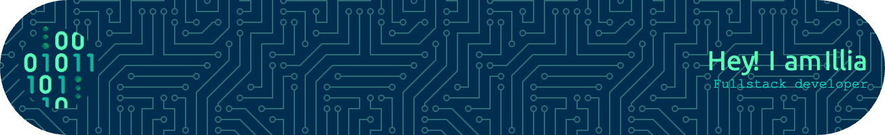

## :heart: build software

Hi, my name is Illia. I am a full-stack developer. I enjoy solving complex engineering problems that need to be thought
through carefully. Constantly interested in everything related to the web platform and Progressive Web Applications.

<h3>Tools, languages, and other things that I like to work with.</h3>

  

&nbsp;

 

<!--
**Barto-dev/Barto-dev** is a ✨ _special_ ✨ repository because its `README.md` (this file) appears on your GitHub profile.
### Hi there 👋
Here are some ideas to get you started:

- 🔭 I’m currently working on ...
- 🌱 I’m currently learning ...
- 👯 I’m looking to collaborate on ...
- 🤔 I’m looking for help with ...
- 💬 Ask me about ...
- 📫 How to reach me: ...
- 😄 Pronouns: ...
- ⚡ Fun fact: ...
  -->
