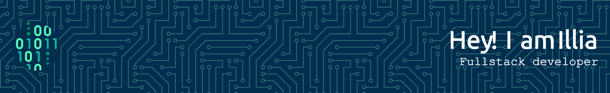

## :heart: build software

Always curious and ready to explore how deep the rabbit hole
goes :rabbit:

<h3>Tools, languages, and other things that I like to work with.</h3>

  

&nbsp;

 

<!--

- 🔭 I’m currently working on ...
- 🌱 I’m currently learning ...
- 👯 I’m looking to collaborate on ...
- 🤔 I’m looking for help with ...
- 💬 Ask me about ...
- 📫 How to reach me: ...
- 😄 Pronouns: ...
- ⚡ Fun fact: ...
  -->
